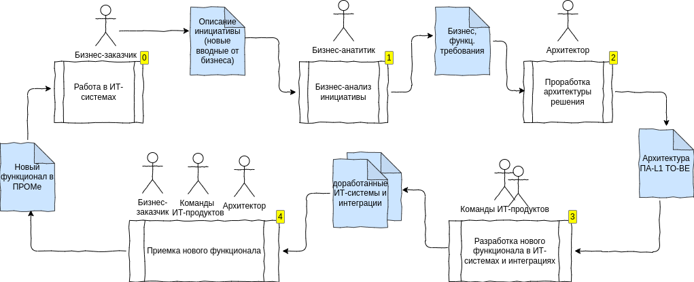
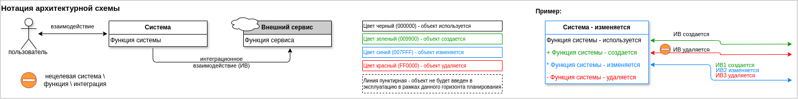
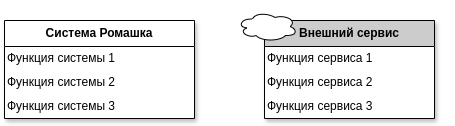
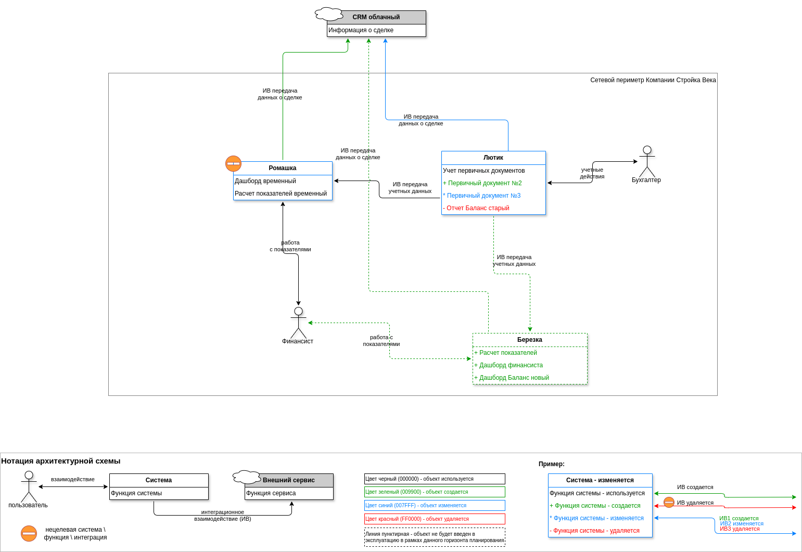
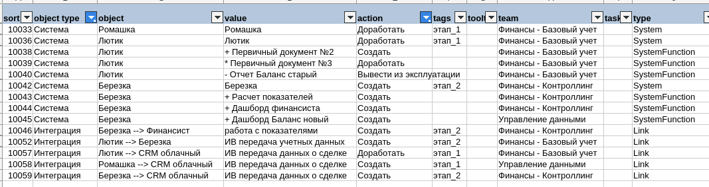

# Рекомендации по использованию tarpar

## Предпосылки создания tarpar

### Производственный цикл в ИТ

Типовой производственный цикл в ИТ-сфере представлен на схеме 

На шаге 2 Архитектор проектирует архитектуру будущего решения. В результате создается прикладная архитектурная схема уровня L1 (уровень "контекст" в терминах модели [С4 model](https://c4model.com/)). Архитектурная схема визуально отражает к какому результату нужно прийти (какие системы и интеграции доработать), чтобы решить задачу бизнеса. Архитектурная схема используется продуктовыми командами для планирования и реализации необходимых доработок ИТ-систем (шаг 3).

На шаге 4 производится передача доработок от продуктовых команд бизнес-заказчику. Архитектор присутствует при сдаче-приемке в качестве контролера - проверяет насколько корректно была реализована ранее предложенная архитектура.

### Проблемы в части архитектуры

Практика показывает, что есть проблемы в прохождении данного цикла:

1. Архитектурные схемы содержат ошибки, неоднозначно интерпретируемые участки, могут неполно передавать информацию о необходимых изменениях. Это происходит из-за того, что компании часто используют простые "рисовалки" (например [drawio](https://github.com/jgraph/drawio-desktop/releases)), при этом не устанавливают правил и нотаций по созданию схем. А специализированные архитектурные инструменты либо дороги, либо недоступны, либо в силу своей сложности не прижились в компании.

2. Для масштабных проектов (десятки систем и интеграций) получаемые схемы большие и трудно воспринимаемые человеком. Это приводит к ошибкам при интерпретации схем и планировании доработок ИТ-системы в продуктовых командах

3. На этапе приемки результатов сложно отслеживать полноту и правильность реализации, глядя только на архитектурную схему. Это снижает качество контроля и создает предпосылки к серьезным ошибкам реализации

### Подход к решению проблем

1. В качестве инструмента создания схем предлагается использовать открытый свободный продукт [drawio](https://github.com/jgraph/drawio-desktop/releases)

2. Архитектура решения описывается на уровне L1 (уровень "контекст" в терминах модели [С4 model](https://c4model.com/)). Основные объекты схемы: _система_, _пользователь_, _интеграция_

3. Нотация архитектурной схемы - максимально упрощенная и вместе с тем информативная. Нотация должна передавать визуальными средствами состояние прикладного ИТ-ландшафта компании на целевую дату с детализацией до уровня отдельной функции системы и отдельного интеграционного взаимодействия с указанием какие доработки в системах и интеграциях (по сравнению с текущим состоянием) должны быть выполнены. Описание нотации приведено в [шаблоне архитектурной схемы](../templates/L1-diagram-template.drawio) (открывать в drawio)

4. Должна быть возможность проанализировать схему на корректность, выявить в ней логические и семантические ошибки

5. Должна быть возможность выгрузить в табличный формат информацию обо всех дорабатываемых объектах, чтобы на ее основе сформировать бэклоги команд и впоследствии проконтролировать реализацию

Утилита **tarpar** предназначена для решения пунктов 4 и 5. На вход утилите подается файл с диаграммой формата drawio, на выходе формируется текстовый реестр объектов в формате csv (разделитель полей точка-с-запятой). Реестр можно загрузить в любой табличный процессор и далее провести необходимый анализ на наличие ошибок в схеме, а также сформировать данные для формирования задач в Jira или подобных системах

## Архитектурная схема ПА-L1 в drawio

### Нотация ПА-L1

Нотация описания прикладной архитектуры уровня L1 приведена в файле [шаблона архитектурной схемы](../templates/L1-diagram-template.drawio): 

### Общие рекомендации по ведению модели в drawio

Здесь и далее приведенные рекомендации предварительно были протестированы на варианте **drawio desktop** версии **24.2.5**

1. В свойствах диаграммы **отключите опции**:

   - _Connection Arrows_
   - _Connection Points_

   Это избавит от назойливого (и не всегда корректного) поведения системы при рисовании стрелок

2. **Включите использование слоев**

   Используйте **отдельный слой** для нотации (легенды). Это позволит в табличной форме быстро отфильтровать элементы нотации, отделив их от полезной информации диаграммы

3. **Используйте объекты нотации как шаблон для копирования**

   Копируйте их, создавайте дубликаты (при перетаскивании удерживайте CTRL). Не используйте объекты из стандартной палитры объектов drawio, т.к. объекты нотации были тонко настроены и эти настройки не копируются при копировании стиля (баг drawio). Объекты из шаблона качественно выгрузятся утилитой **tarpar** в текстовый реестр.

4. **Используйте дополнительные поля** для ведения информации по объекту:

   - поле **tooltip** (CTRL-ALT-T) используйте для пояснения деталей работы объекта (например какие именно изменения нужно сделать в функции системы)
   - поле **team** (CTRL-M) используйте для названия продуктовой команды, ответственной за данный функционал
   - поле **tasks** (CTRL-M) можно использовать для указания идентификаторов задач в системе управления задачами (jira и т.п.)
   - поле **tags** (CTRL-K) можно использовать для расстановки меток на объекты, чтобы потом использовать фильтрацию, поиск по метке

   Данные поля распознаются и выгружаются утилитой **tarpar** в текстовый реестр

5. **Двойные кавычки** и **перевод строки** в текстовых полях объектов drawio использовать можно для улучшения визуального восприятия схемы. Однако, при обработке утилитой **tarpar**, данные символы будут заменены на пробел и одинарные кавычки соответственно. Это необходимо для сохранения целостности csv файла

6. Рекомендуется для основных объектов диаграммы (система, интеграция) **отключить** опцию _Formatted text_ (во вкладке Text правой панели drawio). Это отключает возможность вносить в текстовые поля html\css форматирование и исключает риск ошибочной обработки в утилите **tarpar**

### Объект "Система"

_Система - это комплекс программных или программно-аппаратных средств, реализующий логически связанный набор функциональности для выполнения процессов и задач компании_

1. В нотации ПА-L1 есть два представления для системы - внутренняя система (стоящая внутри ИТ-периметра компании) и внешняя система (сервис, как правило, облачный, находящийся за периметром компании):

   

   Оба эти объекта обрабатываются утилитой **tarpar** единообразно как объект "Система"

2. **Цвет рамки системы** определяет те действия, которые необходимо предпринять продуктовой команде в рамках данного горизонта планирования:

   - Черный цвет `#000000` - никаких изменений над системой проводить не надо (она используется)
   - Зеленый цвет `#009900` - система должна быть внедрена в ПРОМ (на момент создания архитектурной схемы данная система еще не была в эксплуатации)
   - Синий цвет `#0007FF` - система должна быть доработана
   - Красный цвет `#FF0000` - система должна быть выведена из эксплуатации

   Цвет текста заголовка системы - черный `#000000`, вне зависимости от цвета рамки

3. Внутри системы указываются **функции** (прикладная функциональность) - например _Дашборд 'Финансовое здоровье компании'_. Каждая функция должна указываться в отдельном блоке (строке). Блок функции с точки зрения drawio - это отдельный объект диаграммы, связанный с родительским объектом "Система". При обработке утилитой **tarpar** каждая функция выводится отдельной строкой с привязкой к родительской системе

4. **Цвет текста функции** системы определяет те действия, которые необходимо предпринять продуктовой команде в рамках данного горизонта планирования:

   - Черный цвет `#000000` - никаких изменений над функцией проводить не надо (она используется)
   - Зеленый цвет `#009900` - новая функция должна быть внедрена в ПРОМ
   - Синий цвет `#0007FF` - функция должна быть доработана
   - Красный цвет `#FF0000` - функция должна быть удалена из системы

5. **Дополнительные поля** (tooltip, team, tasks, tags) могут быть указаны для каждого объекта индивидуально (для системы и для каждой ее функции)

6. При обработке утилитой **tarpar** для каждой функции реализовано **наследование** поля **team** из родительской системы по алгоритму: если для данной функции не задано поле team И данная функция изменяется (цвет текста не черный), то поле team берется из системы. Это сделано для упрощения ведения схемы при сохранении удобства формирования бэклогов команд на основе архитектурной схемы

### Объект "Интеграция"

_Интеграция (синонимы: интеграционное взаимодействие, интеграционный поток) - это логическая функциональная связь между двумя системами (или системой и пользователем), отражающая передачу данных и\или событий_

1. В нотации ПА-L1 интеграция показывается в виде стрелки, соединяющей два объекта. Утилита **tarpar** автоматически распознает объекты типа "стрелка" и присваивает им имя в формате "система\-источник --> система\-приемник"

2. **Цвет линии стрелки** определяет те действия, которые необходимо предпринять продуктовой команде в рамках данного горизонта планирования:

   - Черный цвет `#000000` - никаких изменений над интеграцией проводить не надо (она используется)
   - Зеленый цвет `#009900` - интеграция должна быть создана и внедрена в ПРОМ
   - Синий цвет `#0007FF` - интеграция должна быть доработана
   - Красный цвет `#FF0000` - интеграция должна быть выведена из эксплуатации

3. У каждой стрелки может быть одна **основная подпись** (задается нажатием ENTER на стрелке) и неограниченное количество **дополнительных подписей** (задаются двойным кликом мыши на стрелке). Таким образом, по аналогии с функциями системы, для одной стрелки на схеме можно указать несколько разных логических интеграционных потоков. При обработке утилитой **tarpar** каждая подпись к стрелке обрабатывается как самостоятельный объект, связанный с родительской стрелкой

4. **Цвет текста подписи к стрелке** системы определяет те действия, которые необходимо предпринять продуктовой команде в рамках данного горизонта планирования:

   - Черный цвет `#000000` - если цвет самой стрелки тоже черный, то никаких изменений над интеграцией проводить не надо. Если цвет стрелки не черный, то действие определяется цветом стрелки
   - Зеленый цвет `#009900` - новая интеграция должна быть внедрена в ПРОМ
   - Синий цвет `#0007FF` - интеграция должна быть доработана
   - Красный цвет `#FF0000` - интеграция должна быть удалена из системы

5. **Дополнительные поля** (tooltip, team, tasks, tags) могут быть указаны для каждого объекта индивидуально (для самой стрелки и для каждой ее дополнительной подписи)

6. При обработке утилитой **tarpar** для каждой интеграции реализовано **наследование** поля **team** из родительской системы-источника по алгоритму: если для данной интеграции не задано поле team И данная интеграция изменяется (цвет не черный), то поле team берется из системы, указанной как источник (source) этой стрелки. Это сделано для упрощения ведения схемы при сохранении удобства формирования бэклогов команд на основе архитектурной схемы

### Прочие объекты

1. В нотации ПА-L1 введен объект **Пользователь**, который соответствует стандартной фигуре **umlActor** drawio. Данный объект обрабатывается утилитой **tarpar** как самостоятельный объект, но без анализа его цвета

2. Разрешено использование любых иных объектов на архитектурной диаграмме. Такие объекты будут обрабатываться утилитой **tarpar** и выгружаться в текстовый реестр, но их анализ производиться не будет. Если какая-либо стрелка будет входить или выходить из такого объекта, то название данной стрелки будет сигнализировать о неизвестном объекте (три подчеркивания), например: _"Ромашка --> \_\_\_"_

### Пример архитектурной диаграммы в нотации ПА-L1

Результат работы утилиты **tarpar** после загрузки в табличный процессор и фильтрации (показать объекты слоя 2, тип объекта непустой, действие - непустое):

